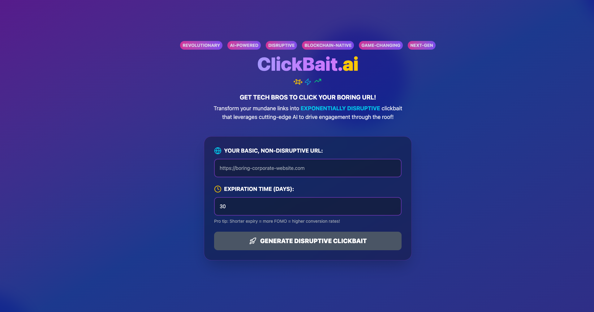

# URL Clickbait

A satirical URL shortener that transforms boring links into clickable tech buzzword URLs

## Project Overview

This project is a full-stack web application that turns URLs to over-the-top tech industry buzzwords.

**Live at**: `https://url-clickbait.onrender.com` 

## Features

- Unique URLs: Generate unique short codes with cryptographically secure randomization
- Tech bro branding: Transforms mundane links into clickbait
- Expriation: Configurable URL lifespans
- Database persistence: PostgreSQL storage 
- CI/CD with Github Actions for automated deployment

## Technical Stack

### Frontend
- **React 18** with TypeScript
- **Tailwind CSS** for styling
- **Vite** for development and building
- **Lucide React** for iconography

### Backend
- **Go 1.23** 
- **Chi Router** for HTTP routing and middleware
- **PostgreSQL** with pgx driver for database operations

## Project Structure

```
shrimpy/
├── client/                # React frontend
│   ├── src/
│   │   ├── components/    # UI components
│   │   └── App.tsx        # Main application logic
│   └── package.json
└── server/                # Go backend
    ├── cmd/shrimpy/       # Application entry point
    ├── internal/
    │   ├── handlers/      # HTTP request handlers
    │   ├── shortener/     # URL shortening logic
    │   └── storage/       # Database operations
    └── go.mod
```

## Key Technical Implementations


### Database Design
```sql
CREATE TABLE urls (
    id SERIAL PRIMARY KEY,
    old_url TEXT NOT NULL,
    new_url VARCHAR(100) UNIQUE NOT NULL,
    created_at TIMESTAMP DEFAULT NOW(),
    expires_at TIMESTAMP
);
```

### API Endpoints
- `POST /shorten` - Create shortened URL with expiration
- `GET /make-money-fast/{key}` - Redirect to original URL